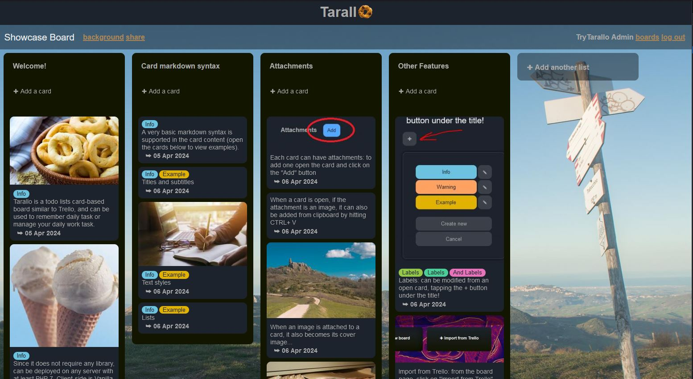
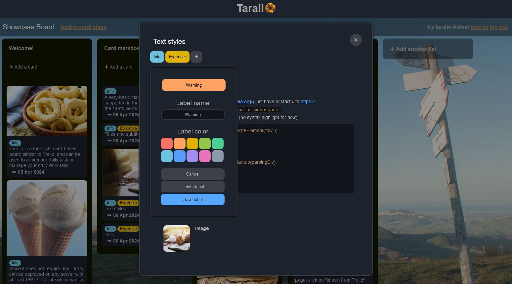
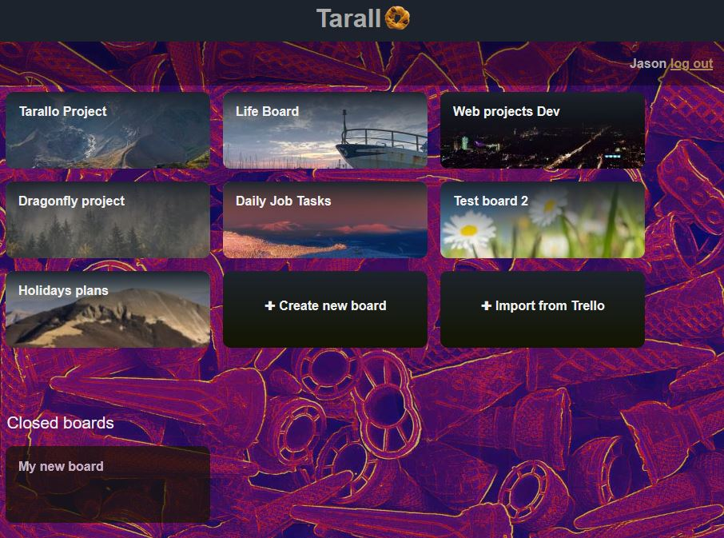

# Tarallo
Minimalistic card-based TODO lists in Vanilla JS.
Build as an easy to host Trello alternative with no dependencies, only requiring PHP 7.
Compatible with any DBMS suported by PHP PDO (see https://www.php.net/manual/en/pdo.drivers.php).

## To try it out
Just create an account here:
https://trytarallo.altervista.org
You will also be able to access a showcase board.
**Mind that the the above instance data will be periodically wiped out!!**

## To host an instance:

### On an existing web server
1. copy the content of `source/` to your web server (sub-directories work fine)
2. modify `config.php` to set `DB_DSN` to the db connection string (and optionally other parameters).
3. run `db/init_db.sql` on your DB

### Docker
1. update variables (database password) in `.env` file
2. run `docker compose build` from project root
3. run `docker compose up -d`
4. access site via [http://localhost:8080](http://localhost:8080)

## Updating an instance to a new version:
1. copy the content of `source/` to your web server, overriding existing ones
2. check your db version (found in the db table `tarallo_settings`): if it's lower than the one in `db/init_db.sql`, all the `db/update_*_to_*.sql` queries that brings your db to the current version should also be executed

Additional settings can be found in the "tarallo_settings" DB table.

